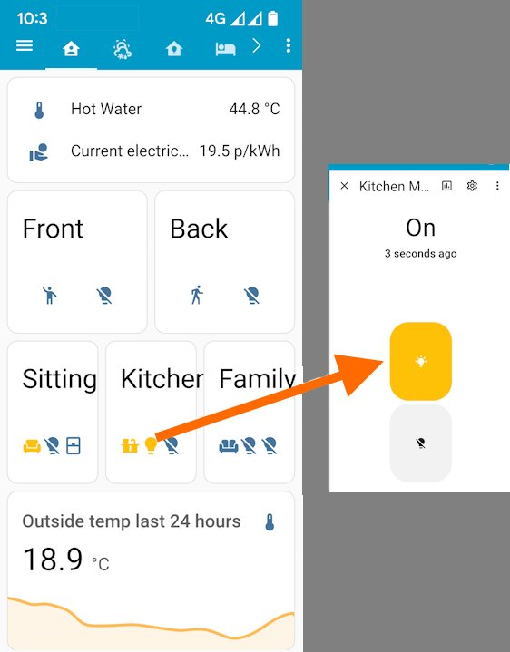

# **HAAPI Cortex**
# Introduction
This project will create an integration between [HomeAssistant (HA)](https://www.home-assistant.io/) and [Idratek Cortex](https://www.idratek.com/slider/cortex/).  The starting point is a working hand crafted integration, the goal is a HACS integration supported by a small community.

The motivation for integrating Cortex and HomeAssistant came from wanting a secure way to access Cortex status / information when outside the home especially from a smart phone. Cortex provides a web page but, without punching a hole through the firewall (opening a port), this is not available externally, nor can it be customised.  HomeAssistant provides both a Cloudflare integration, which provides a secure way to access HomeAssistant remotely, and modern customisable dashboards.  Additionally HomeAssistant is built using Python which is widely regarded as both powerful and easy to learn (the author is not a developer).  The screen shot below shows that HomeAssistant (HA) and Cortex have been integrated with information provided with a modern look and feel.  

This integration will 
* Automate discovery of Cortex objects by HA and create suitable entities for them.
* Enable update of HA entities from Cortex.
* Enable control of Cortex objects from HA.
* Enable display of HA entity information in Cortex eg electricity prices.
* Meet the standards required for [integration publication on HACS](https://www.hacs.xyz/docs/publish/integration/) 

# Contents (in progress)
* **[Foundations](./foundations.md)** covers the approaches developed and tested during the hand-crafted integration phase.  Cortex users could use this information to hand-craft their own HA integration, but it is hoped those with development experience will contribute to this project.
* **Design** A structure to record all the important decisions so that development can progress productively.  This will include links to example JSON.  It is hoped this allow development by those without a functional Cortex installation.
* **Project cards** will be used to define and prioritise work, this will allow the author and contributers to work intermittently on the project as time allows with confidence that the individual efforts will work together.

# Related projects
For information
* [Cortex Alexa integration](https://github.com/ThinklingUK/IdratekAlexa) Alexa Skill to interface with Idratek Cortex web API