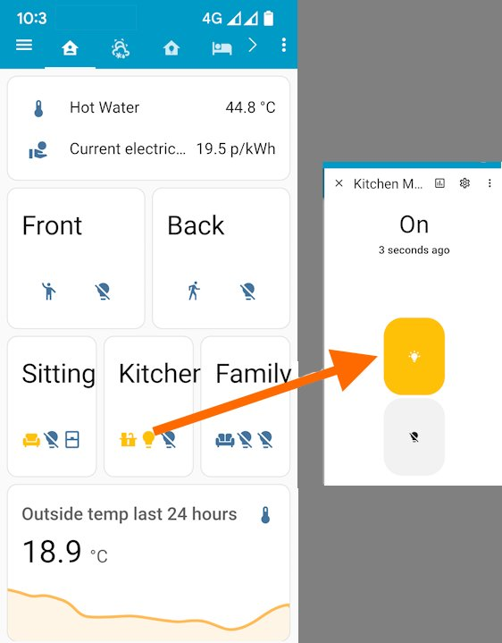

# Foundations: Integration between Cortex & HomeAssistant <!-- omit from toc --> 

This document records the hand-crafted configuration of entities and commands using REST, and WebSocket along with considerations for using these approaches for a more generic integration between Cortex and HomeAssistant.  The approaches have been used for 2+ yeas without needing revision despite many HomeAssistant updates.

## Table of contents <!-- omit from toc --> 
- [1. Origins](#1-origins)
- [2. Aligning distinct world views](#2-aligning-distinct-world-views)
- [3. Example Dashboard](#3-example-dashboard)
- [4. Cortex WebAPI set up and responses](#4-cortex-webapi-set-up-and-responses)
  - [Cortex API requests](#cortex-api-requests)
- [5. Control Object Types](#5-control-object-types)
  - [5.1 Temperature, HVAC-Temperature, AnalogueSignal](#51-temperature-hvac-temperature-analoguesignal)
    - [HomeAssistant Configuration](#homeassistant-configuration)
      - [configuration.yaml](#configurationyaml)
    - [Cortex set-up](#cortex-set-up)
    - [Example JSON response](#example-json-response)
    - [Automation Thoughts](#automation-thoughts)
  - [5.2 Room](#52-room)
    - [HomeAssistant Configuration](#homeassistant-configuration-1)
      - [configuration.yaml](#configurationyaml-1)
      - [automation.yaml](#automationyaml)
    - [Cortex set-up to send object updates to HASS using a webhook](#cortex-set-up-to-send-object-updates-to-hass-using-a-webhook)
    - [Automation Thoughts](#automation-thoughts-1)
  - [5.3 Light](#53-light)
    - [HomeAssistant Configuration](#homeassistant-configuration-2)
    - [Cortex Configuration](#cortex-configuration)
    - [Automation Considerations](#automation-considerations)
  - [5.4 Cortex On/Off Load (HASS Template Switch)](#54-cortex-onoff-load-hass-template-switch)
    - [Cortex Configuration](#cortex-configuration-1)
    - [Progress:](#progress)
    - [Switch - TO DO](#switch---to-do)
  - [5.5 HVAC](#55-hvac)
  - [5.6 Digital Input  (Window, Door, Bell Push)](#56-digital-input--window-door-bell-push)
  - [5.9 Cortex Object Types for potential integration](#59-cortex-object-types-for-potential-integration)
- [6. Enhancements](#6-enhancements)
  - [6.1 Change of pattern: trigger based template switch](#61-change-of-pattern-trigger-based-template-switch)
  - [6.2 Build a dev/test environment](#62-build-a-devtest-environment)
  - [6.3 Webhook enhancements](#63-webhook-enhancements)
  - [6.4 Flexible naming between Cortex and HASS](#64-flexible-naming-between-cortex-and-hass)
- [7. Conclusion](#7-conclusion)
  - [General Challenges / Unknowns](#general-challenges--unknowns)


# 1. Origins

The motivation for integrating Cortex and HomeAssistant came from wanting a secure way to access Cortex status / information when outside the home especially from a smart phone. Cortex provides a web page but, without punching a hole through the firewall (opening a port), this is not available externally, nor can it be customised. HomeAssistant provides both a Cloudflare integration, which provides a secure way to access HomeAssistant remotely, and modern customisable dashboards. Additionally HomeAssistant is built using Python which is regarded as both powerful and easy to learn and widely used.

Additionally

* Cortex & HomeAssistant are built on the principle of local control
* HomeAssistant provides numerous integrations to external information sources such as weather, electricity prices, travel information etc which could be useful to display on Idratek’s display panels

# 2. Aligning distinct world views

[Cortex](https://www.idratek.com/slider/cortex/) (the automation controller for [Idratek devices](https://www.idratek.com/products/module-selector/) and others) and HomeAssistant both provide ‘home automation’ capabilities for the Internet of Things. but the conceptual structure of ‘things’ is quite different and there isn’t good alignment between the worlds as far as I can tell. The following is an attempt to summarise and align the core concepts and capabilities.

|  |  |  |
| --- | --- | --- |
| Concept | HomeAssistant | Cortex |
| Building Blocks | [**Entities**](https://www.home-assistant.io/docs/configuration/entities_domains) Can represent hardware, data, actors. Are used to control other entities. Entities have state and attributes.  **Devices** typically represent hardware which may contain multiple entities (eg 2 relay device, each has an entity)  Integrations allow communication to 3rd party devices and data services  [**Domains**](https://www.home-assistant.io/docs/configuration/entities_domains)– categorise Entities eg light aka ‘IoT Domain’, a bit like a class. Some are vendor (integration) specific.  **Areas** – logical grouping of entities to a physical area/room. | Everything in Cortex is an **Object**. Objects are hierarchical (All are children of ‘World’) they can be physical (aligned with an Idratek module (device)) or logical – each can have State, Values / Behaviours and Ports /Connections.  Objects each have a **Type** (Class). The Type defines the behaviour and the possible attributes the object has and the connections to the object from other objects.  World, House, Floor, Room are examples of Logical object type which can parent other objects |
| Automation | **Automations** can be built using **blueprints** or can be completely customised. They each have triggers, conditions and actions.  **Scripts** also allow repeatable actions to run, but do not have triggers.  Scene – predefined settings for devices | Objects are associated together via their parents and the connections defined by the Object Type. This automatically provides a high level of built in automation.  Eg a relay within a module can be associated with one of several object-types eg light, zone valve, fan, immersion, pump, boiler.  **Scenes** are supported for lights.  **Macros** provide repeatable actions to be defined, these can be triggered by events or scheduled.  **General Logic**: Using the paradigm of electronic logic gates these can be combined and built into custom automations. They can take sources from state and attribute information both binary and analogue. |
| Interworking | **Integrations** (both core and community provided (HACS)) expose third party automation devices via their own controller and data via their service provider to HomeAssistant  **Platform** – the component within an integration that actually communicates with a device or service… so the light Domain may include several Platforms depending on the vendor and the capability of the hardware.  Essentially, an integration (which has a unique domain identifier) uses its platforms to extend Home Assistant's capabilities and provide different device types and states for the user to control. | Cortex provides interworking with hardware from Philips Hue, Home Easy, Rako xAP & X10 It also provides a Web API which can support JSON or XML, which enables users to create their own integrations. |

Although HomeAssistant is built on Python, the configuration is defined in YAML and responses are parsed using Templates. Therefore so far there has been no Python scripting!

Entities include Helpers, although these are listed on separate tabs on the Settings > Devices & Services page; the Helpers listed all also appear on the entities tab.

From the HomeAssistant perspective, all of the integration so far has been completed with

* RESTful integration
* Input Boolean
* Template
* Webhook

# 3. Example Dashboard

The screenshot shows the HomeAssistant mobile app displaying a dashboard built largely from Cortex Objects as described in this document.

* Temperature – Hot water single value at the top, and Outside chart view at the bottom. These values come from QAI and LTH-X01 modules
* Room Object – occupancy state – this is logic object
* Light Object – on/off state. Modules include DRB, QRI, QRH
* Window - on/off state. Digital Input on a DFP module.

State changes are displayed ‘instantly’ in the app on WiFi, ie milliseconds.

Lights can be controlled manually by clicking on the icon and then toggling the presented button. Lights are under Cortex automation using room occupancy + light level etc ie there is rarely a need to change these, so they are for information.

Home Assistant changes the icon colour when on (light) or occupied (room).

# 4. Cortex WebAPI set up and responses

Cortex has a built in Web API, full documentation for this is provided with the application, including this description

The syntax for the API conforms to what is known as REST.  It uses HTTP based commands and conforms to current practice.  It is similar to Web Browser based URL syntax.  The response Cortex provides back as a result of commands received can again be 'Synapse', 'Json' or XML. Access to the WebAPI requires the Web Server and Cortex Mobile licences.  Access is controlled using User names and passwords as well as all the other restrictions options available for normal browser based access to the Cortex Web server.

The following steps are needed to get the API working

1. Procure suitable licences from Idratek
2. Create a username and password for (exclusive use of) the integration;
   1. use the Behaviour menu for the Web Server Object.
   2. See help page ‘Web Server Behaviour – Authorised Users’.
3. Enable each object you wish to expose to the web.
   1. See help page ‘Enabling an object's API for Windows applications’ and ‘Web Server Access Rights’
   2. Note for control you must enable viewing, control and Web API options

## Cortex API requests

It is strongly recommended that a REST client like Postman is installed in your environment and the basic requests are explored. These are described in the ‘Cortex API JSON Syntax’ help page. In summary the URL based commands are below. Responses are given in section 4.

* List all exposed objects: http://``<Cortex Web API addr>``/api/v1/json/objects
* List all Ports for an object: http://``<Cortex Web API addr>``/api/v1/json/objects/<object name OR object ID>
* Query or action an object port: http://``<Cortex Web API addr>``/api/v1/json/ports/<port name or Number>
* List the properties of an object: http://``<Cortex Web API addr>``/api/v1/json/ properties/<object name OR object ID>

JSON formatted commands to send are listed in the documentation, including those for controlling the interface and messages sent and received at shutdown. These have not been used so far, but will be useful if building an API.

# 5. Control Object Types

This section describes the set up on HomeAssistant and Cortex for each Cortex Object Type that was been integrated with HA.

Integrated Object Types

* [5.1 Temperature, HVAC-Temperature, AnalogueSignal](#51-temperature-hvac-temperature-analoguesignal)
* [5.2 Room](#52-room)
* [5.3 Light](#53-light)


## 5.1 Temperature, HVAC-Temperature, AnalogueSignal

### HomeAssistant Configuration

Cortex measures Temp to 7 decimal places internally and so triggering a webhook each time it changes could lead to a lot of unproductive traffic.

Polling roughly every 10 mins seems adequate. So sensors don't all poll at the same time, use scan\_interval of odd seconds between 500 & 700.

Adding a homeassistant unique\_id allows the device to be renamed in Cortex and HASS without impacting the integration.

Build the HA unique ID from Cortex reported Device ID & Port. The Idratek Customer Number is not visible from the API (AFAICT), the user could be asked for it at set-up but it is probably not worth it as without the customer number the, ID would be unique for the integration – which is adequate.

The Port on which Temperature is reported varies by Object Type as shown

|  |  |  |  |  |
| --- | --- | --- | --- | --- |
|  | Device ID | Port | Interval | Object Type |
| Outside Temp | 51 | 0 | 511 | Temperature |
| Sitting Room HVAC | 883 | 0 | 555 | HVAC |
| Hot Water Temp | 38041 | 2 (scaled output) | 501 | AnalogueSignal |
| Solar Panel Temp | 38040 | 2 | 517 | AnalogueSignal |

#### configuration.yaml
```yaml
# Cortex integrations using REST
sensor:
  - platform: rest
    name: Outside Temp
    unique_id: 1050-51-0
    resource: "http://<Cortex IP or hostname>/api/v1/json/Ports/51/0"
    method: GET
    headers:
      User-Agent: Home Assistant
    authentication: basic
    username: !secret CortexAPIuser
    password: !secret CortexAPIpass
    value_template: "{{ value_json.CortexAPI.PortEvent.Value | round(1) }}"
    device_class: temperature
    unit_of_measurement: "°C"
    force_update: true # chart in history
    scan_interval: 511
```
### Cortex set-up

No further set-up beyond that described in 3. Cortex to enable the WebAPI for each Object required.

### Example JSON response
```JSON
{
  "CortexAPI":{
    "PortEvent":{
      "FriendlyName":"Outside Temperature",
      "IDNumber":"51",
      "PortNumber":"0",
      "PortDescription":"Temperature Output",
      "Type":"ValueOut",
      "Value":"19.7578125",
      "State":"false",
      "NoticeText":"19.76"
    }
  }
}
```


### Automation Thoughts

The Value was used rather than the NoticeText as it is the rawest data and both still need rounding.

## 5.2 Room

### HomeAssistant Configuration

Each Room is set-up in configuration.yaml . In this set-up names MUST align between HA and Cortex, an icon is chosen to represent the room and state in the dashboard. The first snippet shows it is quite simple, there is a huge variety of [material design icons](https://pictogrammers.com/library/mdi/) to choose from.

A HomeAssistant automation is also configured to update the state of the room (input\_boolean) when a suitable message is received from Cortex. A Webhook was selected as the trigger for this with an existing script loaded from HACS to change the state of the input\_boolean. This also changes the icon appearance.

It would have been nice to have used the HA ‘Area’ and changed it state but this does not seem possible. Areas do not appear in the Entities list and so as they are not entities they do not have a state.

#### configuration.yaml
```yaml
# Input Boolean for Room Occupancy
# Names MUST align with Cortex Names
input_boolean:
  # Ground Floor
  front_drive:
    name: Front Drive
    icon: mdi:human-greeting
  porch:
    name: Porch
    icon: mdi:door-open
  sitting_room:
    name: Sitting Room
    icon: mdi:sofa-single
  toilet:
    name: Toilet
    icon: mdi:toilet
  kitchen:
    name: Kitchen
    icon: mdi:countertop
  family_room:
    name: Family Room
    icon: mdi:sofa
```

#### automation.yaml
This is a generic webhook automation which works for all rooms.
```yaml
- alias: cortex room state update
  description: update Room / Area status on webhook message
  trigger:
  - platform: webhook
    webhook_id: cortex-room-state
    allowed_methods:
    - POST
    local_only: true
  action:
    service: python_script.hass_entities
    data:
      action: set_state
      entity_id: input_boolean.{{trigger.json.Cortex_HAAPI.State.split('-')[0] | slugify
        }}
      state: 'off yes  '
  id: c9d59523458541d493b82a1885486e1c
```

### Cortex set-up to send object updates to HASS using a webhook

HASS provides the target for webhook message, but these need to be sent from Cortex which needs to be set-up on Cortex.

* Cortex Web API Client cannot determine the name of the object that called it, but it can pass the state of the object
  + Therefore a unique Web API client call is needed for each object calling HASS
* HASS webhook can unpack the name of the object (room or light) from the Cortex webhook message as well as the state and set it correctly.
  + HASS cannot have spaces in entity names, many cortex object friendly names have spaces. This is resolved by using a template and slugify as explained here [template to convert between spaces and underscores](https://community.home-assistant.io/t/converting-names-with-spaces-to-entity-names/459032).

Follow these steps in Cortex

1. Open the Web API client behaviour menu
2. For each object whose state you want to track Add an Entry like
      * Description: Guest Room Occ - HASS
      * HTTP method: POST
      * Content-Type: application/json
      * http://``<HA machine IP or hostname>``:8123/api/webhook/cortex-room-state
      * Body:
```JSON
{
  "Cortex_HAAPI":{
   "State":  "<Guest Room.Occupied State Output=$1>"
  }
}
```
3. Trigger the request on state change of the room object
   For each Room
   1. Open the Connections menu
   2. In the ‘Occupied state output’ connection
   3. Add the appropriate Web client object (Filter= Global, Object = Web Client API, Event Port (Action) = ‘<name of the entry from step 2b> Send’


For further rooms or lights simply …

* copy an existing Web Service Client entry as created above,
* rename to align to the room/light name
* Update the message body to reflect the object’s name (align with name in HASS)
* Goto light connections, More connections
* Add the webhook to "Set State (Output)" connection

### Automation Thoughts

* Change the name to HAAPI\_Cortex … nicer ring, easier to do now!
* Although Rooms use Name to sync at the moment, it may be possible / better to use IDNumber in the future.
  + Following an Object request, names of rooms are reported by Cortex Web API along with an IDNumber. This could be used to set-up the HA end to allow different naming if required - as per Temperature.
  ```JSON
  {
    - "ControlObjectType": "Room",
    - "FriendlyName": "Sitting Room",
    - "IDNumber": "164",
    - "RefImage": "3",
    - "Parent": "Ground Floor",
    - "Prompt.Display.Name": "Sitting Room",
   }
  ```
* It is hard to think Icon choice could be automated, so probably a default will be chosen, eg mdi:account, mdi:sofa, mdi:bed. Users can then configure as they choose.
* Input\_booleans are not currently associated with an Area - investigate
* Input\_booleans are not currently editable in the GUI, they probably need an ID to enable this…. Use the same approach as for Temperature IDs
* Floors could also be set-up, but as they probably don’t hold state (like areas?), there seems little point.
* Object synchronization: The setup on Cortex is tedious and could be a barrier if large numbers of objects need to be synced. There may be a better way of doing this at scale, discussions with Idratek required.

## 5.3 Light

### HomeAssistant Configuration

In Home Assistant, "light" refers to the domain of an entity, a fundamental category that describes the functionality of a device, while a "platform" is the specific code that implements this functionality for a particular integration or device type. An entity's domain, like light. or switch., defines its capabilities (e.g., brightness, color), whereas a platform provides the detailed logic for how a device interacts with that domain.

As there is no Cortex ‘platform’ (yet), the ‘template platform’ allows the use of [templates for lights](https://www.home-assistant.io/integrations/template/#light) to define the state and automations (or scripts) to define actions.

The commands to action are defined in the main configuration.yaml file
```yaml
rest_command:
  cortex_light_on:
    url: http://<Cortex Web API addr>/api/v1/json/objects/{{cortex_light_name}}?Turn%20on=1
    method: POST
    username: !secret CortexAPIuser
    password: !secret CortexAPIpass
    content_type: "application/json"
    payload: "{}"
  cortex_light_off:
    url: http://<Cortex Web API addr>/v1/json/objects/{{cortex_light_name}}?Turn%20off=1
    method: POST
    username: !secret CortexAPIuser
    password: !secret CortexAPIpass
    content_type: "application/json"
    payload: "{}"

```
Each light is defined in a subfile, lights.yaml.

```yaml
#Lights from Cortex
- platform: template
  lights:
    ## Ground Floor
    #
    front_drive_light:
      friendly_name: Front Drive Light
      unique_id: 916-37996-0
      turn_on:
        service: rest_command.cortex_light_on
        data:
          cortex_light_name: Front Drive Light
      turn_off:
        service: rest_command.cortex_light_off
        data:
          cortex_light_name: Front Drive Light
    #
    side_path_light:
      friendly_name: Side Path Light
      unique_id: 916-37995-0
      turn_on:
        service: rest_command.cortex_light_on
        data:
          cortex_light_name: Side Path Light
      turn_off:
        service: rest_command.cortex_light_off
        data:
          cortex_light_name: Side Path Light
    #
```
### Cortex Configuration

A webhook is used to keep the state aligned with Cortex, the approach to this was described in section above: Cortex set-up to send object updates to HASS using a webhook

### Automation Considerations

Firendly names are easier to use than object IDs but these need to be aligned between the 2 systems

It would be useful include the All Light object to access the GoodNight operation (to switch off the lights of all unoccupied rooms) etc.

## 5.4 Cortex On/Off Load (HASS Template Switch)
The nearest HASS entity type to the on/off load Object type is switch
In Cortex this can be switched on/off, Pulsed on/off (duration configurable in Cortex)
Pulse On / switch Off seems like the ideal button behaviour for pump, immersion, where the on-action should be for a fixed duration.  This type of action also looks like a good fit with the https://github.com/custom-cards/button-card
For the pump Pulse On if off. - add these as REST commands

Each switch is defined in template.yaml
```yaml
- switch:
    - name: Solar pump
      unique_id: cortex_38017
      # "ControlObjectType":"OnOffLoad"
      turn_on:
        service: rest_command.cortex_object_pulse_on
        data:
          cortex_object_id: 38017
      turn_off:
        service: rest_command.cortex_object_off
        data:
          cortex_object_id: 38017
      #restore_state: OFF
```

Webhook in automation.yaml
```yaml
# Sep25
- alias: cortex on off load state
  id: cortex_on_off_load_state
  description: Update on/off load (switch) on webhook message
  trigger:
    platform: webhook
    webhook_id: cortex_onoff_state
    allowed_methods:
      - POST
    local_only: true
  action:
    service: python_script.hass_entities
    data:
      action: set_state
      entity_id:
        switch.{{trigger.json.HAAPI_Cortex.State.split('-')[0] | slugify }}
      state:
        " off 
         on  "
```
Example payload as seen in the logbook http://*instance_name*:8123/config/automation/trace/cortex_on_off_load_state

```
trigger:
  platform: webhook
  webhook_id: cortex_onoff_state
  json:
    HAAPI_Cortex:
      IDNumber: '38021'
      State: |
        Solar Pump - Off.
```
I've no idea why the pipe and line break characters are sent by Cortex, but they are parsed out with the template.  SLugify deals with different capitalisation and spurious full stop.

### Cortex Configuration

A webhook is used to keep the state aligned with Cortex, the approach to this was described in section above: Cortex set-up to send object updates to HASS using a webhook.  Added the Cortex 'IDNumber' in this example
```json
{
  "HAAPI_Cortex":{
   "IDNumber":  "38021",
   "State":  "<solar pump.set state (output)=$1>"
     }
}
```

### Progress:
- Reuses generic on/off rest commands
- added a rest command service for toggle 
- Added additional paramters to the JSON sent from Cortex
- webhook: Cannot address an entity by its unique id.
- Cannot use a 'friendly name:' label in yaml - bit of a nightmare for programatic set up, see enhancement 6.4


### Switch - TO DO
- use a Cortex pulse as the 'on' service
- possible to define the starting (after HASS restart/reboot) state of the switch ... restore_state doesn't work.
- 


## 5.5 HVAC

## 5.6 Digital Input  (Window, Door, Bell Push)

## 5.9 Cortex Object Types for potential integration

It might be useful to integrate the following Cortex Object Types using the recipes above

|  |  |
| --- | --- |
| Cortex Object Type | Potential pattern |
| HVAC | Similar pattern to light using <https://www.home-assistant.io/integrations/climate>  Includes Humidity, but does not have the concept of setpoint by hour. Unclear if this can be built from a Template |
| Hot Water | Similar to light using <https://www.home-assistant.io/integrations/water_heater>  includes ‘eco mode’ concept not seen in Cortex |
| Light level | Possibly illuminance within <https://www.home-assistant.io/integrations/sensor> and https://www.home-assistant.io/integrations/template/#sensor|
| onOffLoad (Fan) | <https://www.home-assistant.io/integrations/fan> and https://www.home-assistant.io/integrations/template/#fan |
| OnOffLoad – general | <https://www.home-assistant.io/integrations/switch> and https://www.home-assistant.io/integrations/template/#switch |
| Digital Input, inc bell push, window, door | Boolean or <https://www.home-assistant.io/integrations/sensor> and  covered in the Template integration https://www.home-assistant.io/integrations/template/#sensor|

# 6. Enhancements
## 6.1 Change of pattern: trigger based template switch
As recommended below to remove the non-core HASS entities custom integration.
https://community.home-assistant.io/t/help-debugging-template-switch-update-by-webhook/935569/2

Check new approach:
- works with buttons & 
- can provide 2 way control

## 6.2 Build a dev/test environment

## 6.3 Webhook enhancements
Make webhook cope with optional JSON payloads 
rework existing Cortex Web API client calls to send consistent JSON

## 6.4 Flexible naming between Cortex and HASS
- create HASS entity with name cortex_'objectID', then change the friendly name in the UI
- consider a name like cortex_'ID'_Friendly name ... will make changing the name in the UI easier - possibly programatic later?

# 7. Conclusion

The experimentation here has shown that Cortex objects can be exposed to HomeAssistant and usefully included in Dashboards allowing realtime display and control. Automations are also possible eg switching a water heater or other load on when electricity prices are low.

For Idratek customers, automation is probably best centred on Cortex due to the rich native automations that come out of the box. However Home Assistant does have a large number of actively supported integrations including weather sources solar energy production etc. So it may also be useful to send some of this information into Cortex for eg display and speaking out via DFPs.

Home Assistant has also made great strides towards providing a locally hosted voice assistant. Combined with Idratek audio modules (DFPs), this opens exciting possibilities for future integration goals.

In conclusion while there isn’t direct alignment between Cortex and HomeAssistant, each has their strengths and so making a simple to use and formal integration will be a worthwhile step to combining these two systems.

## General Challenges / Unknowns

* How to build the integrations so they can be edited via the GUI, eg selecting the icon. This may help <https://developers.home-assistant.io/docs/config_entries_index#for-platforms>
* How to structure an integration … hopefully the guidance here will be of use[: integration publication on HACS](https://www.hacs.xyz/docs/publish/integration/)
* Once the objects are in HASS - how to make it look beautiful - outside the scope of this project, but keen to know what people are doing with it!

No architectural decisions have been taken on any future integration so the following are merely considerations for the design (numbered for reference, not priority etc):

1. API Client: A Python-based class for interfacing with Cortex’s JSON API endpoints, handling authentication and data parsing.
2. REST Bridge: Mechanisms enabling state changes in HA to be propagated back to Cortex using its REST API and visa versa - eg to cope with either system shutting down (eg for update) and then restarting .. with or without the other present.
3. Configuration and Discovery: User-friendly YAML & UI setup options for connecting to Cortex objects and managing integration options. eg At startup and daily.
6. Entity & Helper Factory: Logic for translating Cortex objects of various ObjectTypes into appropriate HA entities, helpers, Areas etc handling their instantiation, registration, update?
7. WebSocket Listeners: A persistent connections for receiving push updates from Cortex objects, triggering entity/helper updates in HA.  A change from a webhook - not known if Cortex can support this, or if it would require an add-on to Cortex?
8. Other
   1. Assume persistence is by writing to the configuration.yaml and other files rather than a database
   2.  Be good if entities created by HAAPICortex can be edited in the GUI